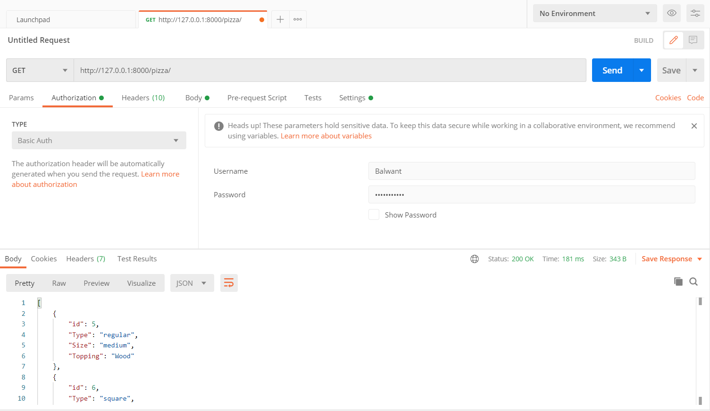
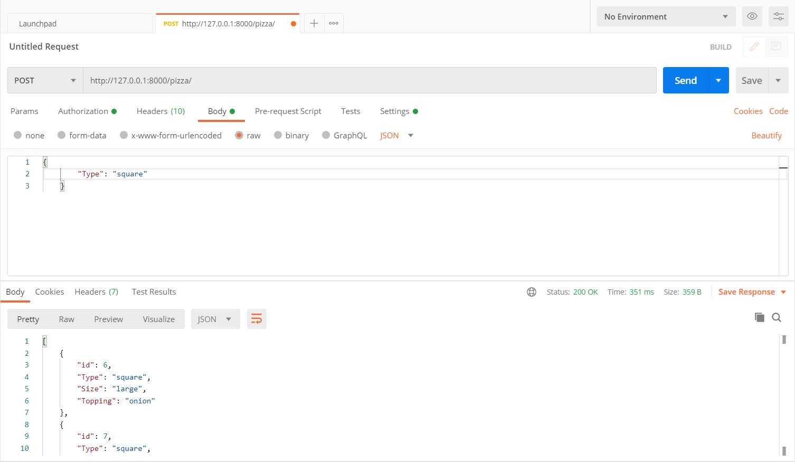
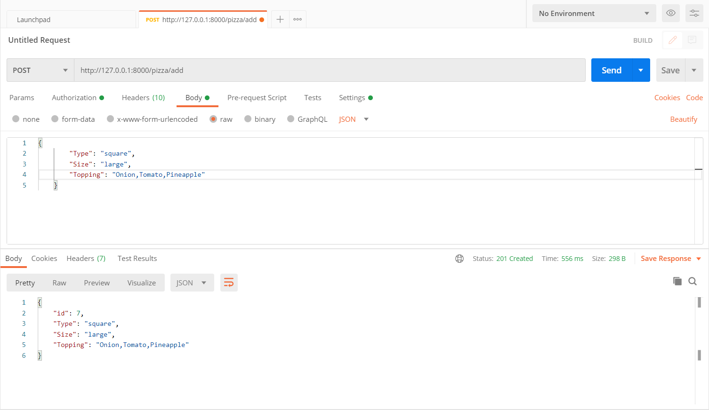
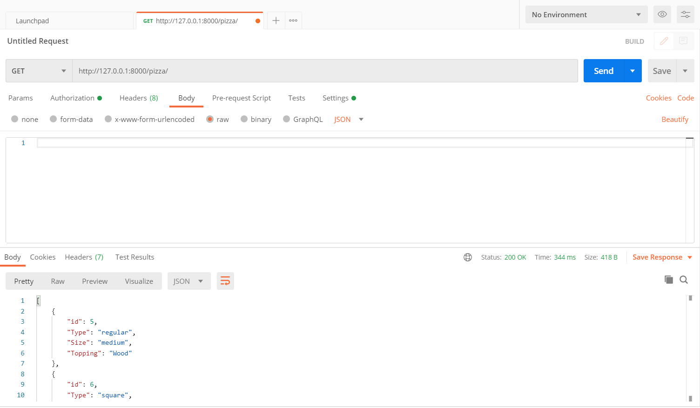
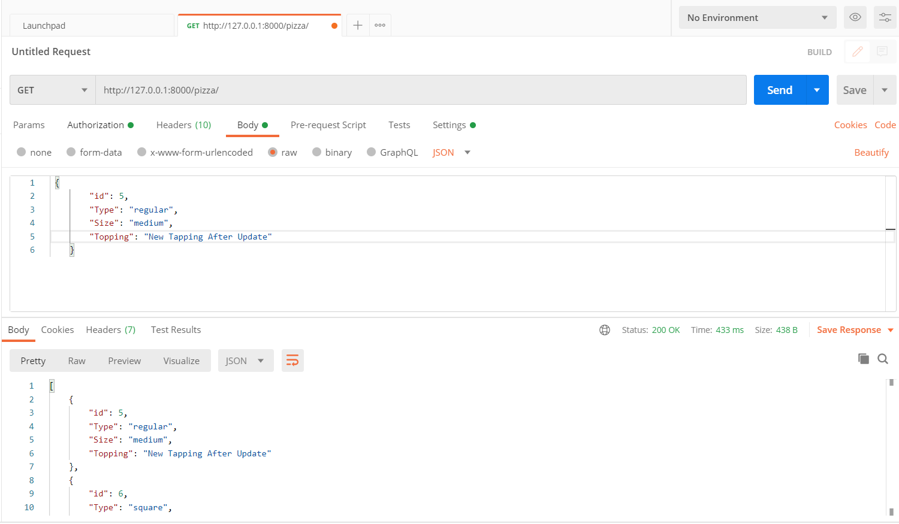
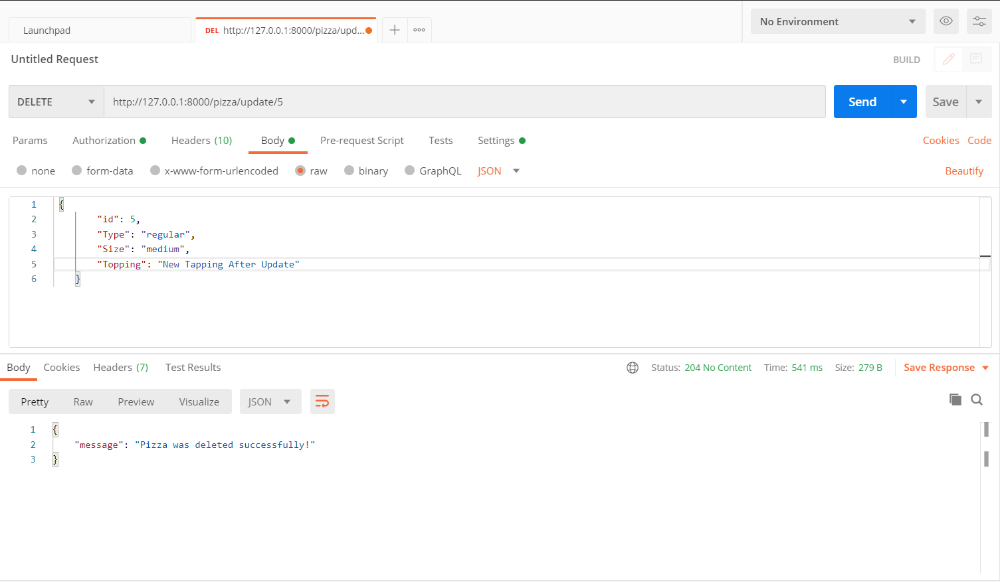
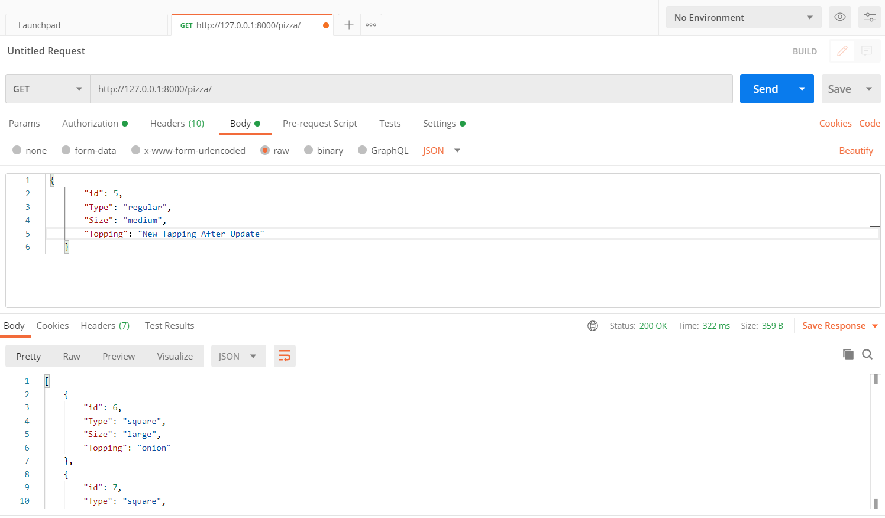

# Pizza
How to RUN this PROJECT-:
1. First thing first install Python.
2. Install pip (Read the documentation(https://pip.pypa.io/en/stable/installing/) if you don't know how to).
3. Then install all the dependencies from requirement.txt
4. Create a Postgres Database with user and password.
5. Replace Database details with your details in Database section settings.py in Pizza directory.
6. Run python manage.py runserver

# All The Api EndPoints.
1. To get list of all Stored Pizzas Use-:
  GET request with url http://localhost:8000/pizza/
2. To filter specific category of Pizzas for example By Regular or Square Type or Size then Use-:
  POST request with http://localhost:8000/pizza/ and json data (ex.={"Type":"regularlar"} to get all regular type pizzas}
3. To create a new Pizza use-:
  POST request http://localhost:8000/pizza/add/ and json data (ex.={"Type":"regular","Size":"medium","Topping":"Onion,Tomato"} be carefull  every key and Type value is case sensitive)
4. To Update any Pizza Use-:
  PUT request http://localhost:8000/pizza/update/id_of_pizza here id_of_pizza is integer and you can get it from 1st api endpoint and also add json data like 3rd api endpoint
5. To Delete any Pizza Use-:
  DELETE request http://localhost:8000/pizza/update/id_of_pizza here id_of_pizza is same as 4th api endpoint and you don't need to send any data

# For Accessing all the API EndPoint You must be a Logged in as active User.

# My Testing ScreenShots On POSTMAN.
 
 
 1st Endpoint for getting Pizza List with GET request.
 
  .
 
 
 2nd Endpoint for getting Filtered List of Pizza with POST request.
 
  .
 
 
 3rd Endpoint for Creating a Pizza with POST request.
 
  .
  
  After Adding.
  
  .
 
 
 4th Endpoint for Updating existing Pizza with POST request.
 
  Before Update.
  
  .
  
  UpDating.
  
  .
  
  After Update.
  
  .
  
 
 5th Endpoint for Deleting a Pizza with DELETE request.
 
  Deleting.
  
  .
  
  After Delete.
  
  .
